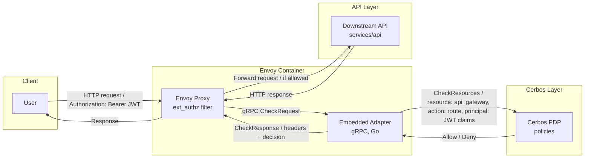

# Cerbos + Envoy architecture demos

This repository showcases multiple ways to integrate Envoy with Cerbos using a small
Go-based sample application. Each scenario runs under Docker Compose and shares a
common downstream REST API, policy bundle, and token fixtures.

## Scenario: Envoy External Auth Adapter

This scenario runs Envoy and a Go-based external authorization adapter in the same container. Envoy forwards incoming requests to the adapter via gRPC; the adapter extracts JWT claims, verifies the JWT signature with a local development certificate, sends the token to Cerbos for verification, and then calls the Cerbos PDP for an `api_gateway` policy decision before traffic reaches the downstream API. The container uses `tini` to supervise both processes and propagate signals cleanly.



### Running the example

1. Generate the signing keypair and JWKS used in development (one-time setup). These artifacts are git-ignored and can be regenerated at any time:

   ```sh
   openssl genrsa -out tokens/jwt-signing.key 2048
   openssl req -x509 -new -key tokens/jwt-signing.key -out tokens/jwt-signing.crt -days 365 -subj "/CN=envoy-adapter"
   openssl rsa -in tokens/jwt-signing.key -pubout -out tokens/jwt-signing.pub.pem
   python3 tokens/to_jwks.py
   ```

2. Start the stack:

   ```sh
   docker compose up --build
   ```

   This launches Cerbos PDP (preloaded with the policies under `services/cerbos/policies/`), the sample API, and the combined Envoy container that bundles Envoy with the external auth adapter binary.

3. Call the downstream API through Envoy using a fixture token (change `alice` to `bob`, `carol`, or even `invalid` for a denied example). The helper script signs the token with the local RSA key before Cerbos verifies it:

   ```sh
   TOKEN=$(python3 tokens/emit_token.py alice)
   curl -isS -H "Authorization: Bearer ${TOKEN}" http://localhost:18000/api/documents
   ```

   The response will include the `x-accountId` header returned by the adapter along with any `x-authz-*` headers that Envoy forwards. Token payload fixtures live under `tokens/*.json` if you need to tweak the claims.

Stop the stack with `docker compose down` when you are done testing.
