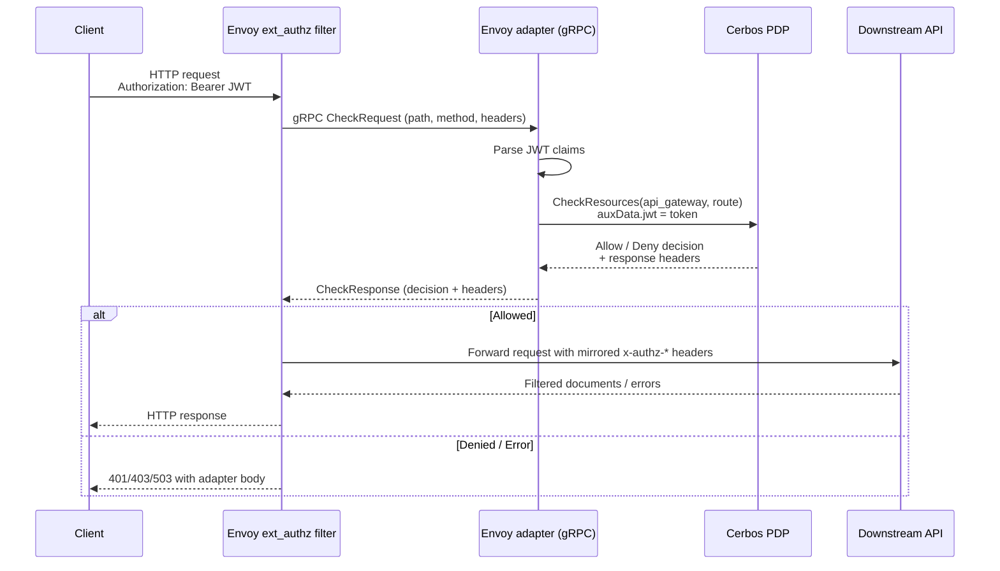

# Cerbos + Envoy architecture demos

This repository showcases multiple ways to integrate Envoy with Cerbos using a small
Go-based sample application. Each scenario runs under Docker Compose and shares a
common downstream REST API, policy bundle, and token fixtures.

## Scenario: Envoy External Auth Adapter

This scenario runs Envoy and a Go-based external authorization adapter in the same container. Envoy forwards incoming requests to the adapter via gRPC; the adapter extracts JWT claims, forwards the raw JWT to Cerbos for verification, and then calls the Cerbos PDP for an `api_gateway` policy decision before traffic reaches the downstream API. The container uses `tini` to supervise both processes and propagate signals cleanly.



### Running the example

1. Generate the signing keypair and JWKS used in development (one-time setup). These artifacts are git-ignored and can be regenerated at any time:

   ```sh
   openssl genrsa -out tokens/jwt-signing.key 2048
   openssl req -x509 -new -key tokens/jwt-signing.key -out tokens/jwt-signing.crt -days 365 -subj "/CN=envoy-adapter"
   openssl rsa -in tokens/jwt-signing.key -pubout -out tokens/jwt-signing.pub.pem
   python3 tokens/to_jwks.py
   ```

2. Start the stack:

   ```sh
   docker compose up --build
   ```

   This launches Cerbos PDP (preloaded with the policies under `services/cerbos/policies/`), the sample API, and the combined Envoy container that bundles Envoy with the external auth adapter binary.

3. Call the downstream API through Envoy using a fixture token (change `alice` to `bob`, `carol`, or even `invalid` for a denied example). The helper script signs the token with the local RSA key before Cerbos verifies it.

   ```sh
   TOKEN=$(python3 tokens/emit_token.py alice)
   curl -isS -H "Authorization: Bearer ${TOKEN}" http://localhost:18000/api/documents
   ```

   The response will include the `x-authz-accountid` header returned by the adapter along with any `x-authz-*` headers that Envoy forwards. Token payload fixtures live under `tokens/*.json` if you need to tweak the claims.

Stop the stack with `docker compose down` when you are done testing.

### Downstream API (`services/api/main.go`)

- Exposes `GET /healthz` (`ok` body), `GET /openapi.json`, `GET /api/documents`, and `GET /api/{accountId}/documents`. The OpenAPI document at `services/api/openapi.json` reflects the runtime behaviour.
- Both `/api` endpoints require the adapter-populated `x-authz-id` and `x-authz-roles` headers. Roles may be a JSON array or a comma-separated string. Optional account context is read from `x-authz-accountId` or `z-authz-accountId` when Envoy rewrites headers.
- Each request is authorized by sending a `CheckResources` call to Cerbos with `document` resources that include the document status and owning account. Only documents that Cerbos allows for the `read` action are returned.
- `GET /api/documents` returns the allowed documents as an array. `GET /api/{accountId}/documents` echoes the provided path parameter as `accountID` and returns the same filtered document list.
- Document objects contain `id`, `accountId`, `title`, `body`, and `status` fields. All `x-authz-*` request headers are mirrored back into the HTTP response.
- Missing or malformed authentication headers result in `401` responses (`{"error":"..."}`), while Cerbos connectivity or decision errors produce a `500` with the same error shape.

### Envoy external auth adapter (`services/envoy/adapter/main.go`)

- Listens for Envoy ext_authz `CheckRequest` calls over gRPC (default `:9090`) and connects to Cerbos using the address from `CERBOS_GRPC_ADDR`/`CERBOS_ENDPOINT` or `cerbos:3593`.
- Extracts the Bearer token from the incoming `Authorization` header, parses the claims without signature verification (Cerbos performs signature and key validation via the supplied JWKS), and rejects requests when the token cannot be decoded.
- Builds the Cerbos principal from the JWT subject and the `roles` claim, which must be an array of non-empty role strings. Empty role sets are rejected.
- Authorizes the request against the `api_gateway` resource (using the HTTP method and path) and the `route` action. Denied, unauthenticated, or invalid requests return Envoy-compatible `DeniedHttpResponse` messages with appropriate HTTP status codes.
- When Cerbos allows the action, the adapter flattens the decision outputs into lowercase HTTP headers (e.g., `x-authz-id`, `x-authz-roles`, `x-authz-accountid`, `x-authz-foo`).
- Gracefully handles shutdown signals and logs authorization or Cerbos connectivity errors to aid debugging.

### Cerbos policies (`services/cerbos/policies`)

- `resource_policies/api_gateway.yaml:2-36` defines the ext_authz gate. Users with the `user` role may route requests only when their JWT `accountId` matches the `/api/{accountId}/documents` prefix they are calling, while `admin` users can route every path. Successful decisions return the JWT-derived headers plus a `x-authz-foo: bar` marker for debugging.
- `resource_policies/document.yaml:2-21` governs the downstream API’s document filtering. Regular users can read documents when their principal `accountId` matches the document’s owning account and the document is `published`. Administrators bypass these checks.
- The adapter supplies JWT claims as `request.auxData.jwt.*` and the downstream API adds the principal’s `accountId` attribute before asking Cerbos, so the two policies work together to restrict routing and document visibility.

### Example requests

- `alice` (user, `acct-123`) via Envoy:

  ```sh
  TOKEN=$(python3 tokens/emit_token.py alice)
  curl -isS -H "Authorization: Bearer ${TOKEN}" http://localhost:18000/api/documents
  ```

  ```
  HTTP/1.1 200 OK
  x-authz-accountid: acct-123
  x-authz-foo: bar
  x-authz-id: alice
  x-authz-roles: ["user"]
  content-type: application/json; charset=utf-8

  [{"id":"doc-2","accountId":"acct-123","title":"Team roster","body":"Contacts for the team assigned to acct-123.","status":"published"}]
  ```

- `bob` (user, `acct-456`) has no published documents, so the same request returns an empty array:

  ```sh
  TOKEN=$(python3 tokens/emit_token.py bob)
  curl -sS -H "Authorization: Bearer ${TOKEN}" http://localhost:18000/api/documents
  # => []
  ```

- `carol` (admin) receives every document, or can call the account-scoped endpoint to see the echoed `accountID` along with the mirrored headers:

  ```sh
  TOKEN=$(python3 tokens/emit_token.py carol)
  curl -isS -H "Authorization: Bearer ${TOKEN}" http://localhost:18000/api/acct-123/documents
  ```

  ```
  HTTP/1.1 200 OK
  x-authz-accountid: acct-123
  x-authz-foo: bar
  x-authz-id: carol
  x-authz-roles: ["admin"]
  content-type: application/json; charset=utf-8

  {"accountID":"acct-123","documents":[{"id":"doc-1","accountId":"acct-123","title":"Quarterly plan","body":"Internal roadmap for acct-123.","status":"draft"},{"id":"doc-2","accountId":"acct-123","title":"Team roster","body":"Contacts for the team assigned to acct-123.","status":"published"},{"id":"doc-3","accountId":"acct-456","title":"Budget","body":"Budget for acct-456.","status":"archived"}]}
  ```
