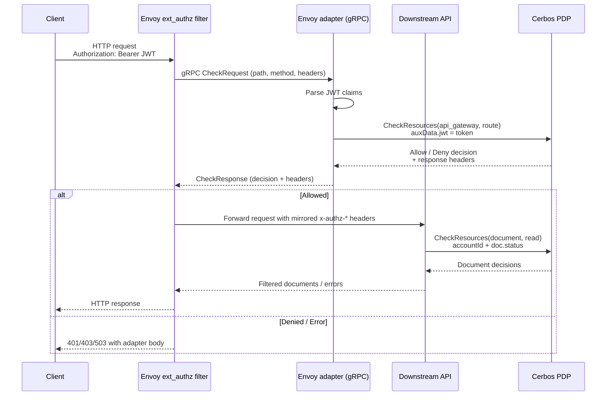

# Cerbos + Envoy Unified Authorization Demo

This repository demonstrates how a single Cerbos policy decision point (PDP) can enforce authorization consistently at two layers:

- **Ingress (Envoy ext_authz filter):** Envoy delegates authentication and coarse-grained route authorization to a gRPC adapter that calls Cerbos.
- **Application (Go API):** The downstream service reuses the same Cerbos policies for fine-grained document filtering.

The result is an end-to-end architecture where policy logic lives once, while both edge and service layers receive real-time decisions and correlated audit output.

> **Production note:** This demo uses locally mounted policy bundles for convenience. In production, the PDP would connect to [Cerbos Hub](https://cerbos.dev/hub) to fetch signed policies and stream decision audit logs to your observability platform.

## Architecture Overview



### Why this pattern matters

- **Single policy surface:** Both Envoy and the application enforce the same policies and attribute vocabulary, eliminating drift between perimeter and service layers.
- **Defense in depth without duplication:** Coarse authorization (route) and fine-grained decisions (document-level) reuse shared logic.
- **Operational simplicity:** In production, Cerbos Hub delivers policy versioning, drift detection, and central audit trails for regulatory review.
- **Pluggable trust:** The adapter forwards raw JWTs to Cerbos for signature verification so the gateway or the api needs to implement this logic.

## Policy Flow in Detail

- **Envoy external auth:** The adapter validates JWT headers, forwards the untouched token to Cerbos for signature verification, and requests a decision on the `api_gateway` policy. Denied requests never reach the API.
- **Downstream API:** Allowed requests inherit headers such as `x-authz-id`, `x-authz-roles`, and `x-authz-accountId`. The API scopes its dataset by `accountID`, then calls Cerbos for the `document` policy to filter individual records.
- **Consistent context:** Both layers evaluate the same subject attributes and enrich decisions with policy-defined outputs, ensuring deterministic enforcement regardless of where access is evaluated.

### Running the example

1. Generate the signing keypair and JWKS used in development (one-time setup). These artifacts are git-ignored and can be regenerated at any time:

   ```sh
   openssl genrsa -out tokens/jwt-signing.key 2048
   openssl req -x509 -new -key tokens/jwt-signing.key -out tokens/jwt-signing.crt -days 365 -subj "/CN=envoy-adapter"
   openssl rsa -in tokens/jwt-signing.key -pubout -out tokens/jwt-signing.pub.pem
   python3 tokens/to_jwks.py
   ```

2. Start the stack:

   ```sh
   docker compose up --build
   ```

   This launches Cerbos PDP (preloaded with the policies under `services/cerbos/policies/`), the sample API, and the combined Envoy container that bundles Envoy with the external auth adapter binary.

3. Call the downstream API through Envoy using a fixture token (change `alice` to `bob`, `carol`, or even `invalid` for a denied example). The helper script signs the token with the local RSA key before Cerbos verifies it.

   ```sh
   TOKEN=$(python3 tokens/emit_token.py alice)
   curl -isS -H "Authorization: Bearer ${TOKEN}" http://localhost:18000/api/acct-123/documents
   ```

   The response will include the `x-authz-accountid` header returned by the adapter along with any `x-authz-*` headers that Envoy forwards. Token payload fixtures live under `tokens/*.json` if you need to tweak the claims, and changing the path (for example to `/api/acct-456/documents`) demonstrates the gateway’s account check.

Stop the stack with `docker compose down` when you are done testing.

### Envoy external auth adapter (`services/envoy/adapter/main.go`)

- Listens for Envoy ext_authz `CheckRequest` calls over gRPC (default `:9090`) and connects to Cerbos using the address from `CERBOS_GRPC_ADDR`/`CERBOS_ENDPOINT` or `cerbos:3593`.
- Extracts the Bearer token from the incoming `Authorization` header, parses the claims without signature verification (Cerbos performs signature and key validation via the supplied JWKS), and rejects requests when the token cannot be decoded.
- Builds the Cerbos principal from the JWT subject and the `roles` claim, which must be an array of non-empty role strings. Empty role sets are rejected.
- Authorizes the request against the `api_gateway` resource (using the HTTP method and path) and the `route` action. Denied, unauthenticated, or invalid requests return Envoy-compatible `DeniedHttpResponse` messages with appropriate HTTP status codes.
- When Cerbos allows the action, the adapter flattens the decision outputs into lowercase HTTP headers (e.g., `x-authz-id`, `x-authz-roles`, `x-authz-accountid`, `x-authz-foo`).
- Gracefully handles shutdown signals and logs authorization or Cerbos connectivity errors to aid debugging.

### Cerbos policies (`services/cerbos/policies`)

- `resource_policies/api_gateway.yaml:2-36` defines the ext_authz gate. Requests from `user` principals only pass through Envoy when the path starts with `/api/{accountId}/documents` for the same `accountId` that appears in the JWT, enforcing account-level routing at the gateway. `admin` principals are allowed to reach `/api/admin` and all other routes. Successful decisions return the JWT-derived headers plus a `x-authz-foo: bar` marker for debugging.
- `resource_policies/document.yaml:2-21` governs the downstream API’s document filtering. Regular users can read documents when their principal `accountId` matches the document’s owning account and the document is `published`, so drafts and archived documents are hidden from them even after the gateway check. Administrators bypass these checks and receive every document scoped to the requested account.
- The adapter supplies JWT claims as `request.auxData.jwt.*` and the downstream API adds the principal’s `accountId` attribute before asking Cerbos, so the two policies work together to restrict routing and document visibility.

### Downstream API (`services/api/main.go`)

- Exposes `GET /healthz` (`ok` body), `GET /openapi.json`, `GET /api/documents`, and `GET /api/{accountId}/documents`. The OpenAPI document at `services/api/openapi.json` reflects the runtime behaviour.
- Both `/api` endpoints require the adapter-populated `x-authz-id` and `x-authz-roles` headers. Roles must arrive as a JSON array. Optional account context is read from `x-authz-accountId` (or `z-authz-accountId` if Envoy rewrites headers).
- Each account-scoped request is authorized by first scoping the in-memory dataset to the requested `accountID` and then sending a `CheckResources` call to Cerbos with `document` resources that include the document status and owning account. Regular users only receive `published` documents from their own account, while administrators bypass the status check and see everything for the requested account.
- `GET /api/documents` returns the allowed documents as an array. `GET /api/{accountId}/documents` echoes the provided path parameter as `accountID` and returns the same filtered document list (with the additional `accountID` wrapper).
- Document objects contain `id`, `accountId`, `title`, `body`, and `status` fields. All `x-authz-*` request headers are mirrored back into the HTTP response.
- Missing or malformed authentication headers result in `401` responses (`{"error":"..."}`), while Cerbos connectivity or decision errors produce a `500` with the same error shape.

### Example requests

Mint a JWT for each principal with `TOKEN=$(python3 tokens/emit_token.py <alice|bob|carol>)` and call Envoy at `http://localhost:18000`. Successful responses echo the `x-authz-*` headers that Envoy receives from the adapter. After the Docker stack is running, execute `./test.sh` to hit all routes for every token and print the HTTP status plus JSON body.

| Token (roles)                 | Route                     | Gateway behaviour                      | Service result                                     |
| ----------------------------- | ------------------------- | -------------------------------------- | -------------------------------------------------- |
| `alice` (`user`, `acct-123`)  | `/api/acct-123/documents` | Allowed – path matches JWT `accountId` | Returns only the published document for `acct-123` |
| `alice` (`user`, `acct-123`)  | `/api/acct-456/documents` | Denied – account mismatch              | `403` with `access denied`                         |
| `alice` (`user`, `acct-123`)  | `/api/admin`              | Denied – requires `admin` role         | `403` with `access denied`                         |
| `bob` (`user`, `acct-456`)    | `/api/acct-123/documents` | Denied – account mismatch              | `403` with `access denied`                         |
| `bob` (`user`, `acct-456`)    | `/api/acct-456/documents` | Allowed – path matches JWT `accountId` | Returns empty list (`archived` doc filtered)       |
| `bob` (`user`, `acct-456`)    | `/api/admin`              | Denied – requires `admin` role         | `403` with `access denied`                         |
| `carol` (`admin`, `acct-123`) | `/api/acct-123/documents` | Allowed – admins bypass account check  | Returns draft + published documents for `acct-123` |
| `carol` (`admin`, `acct-123`) | `/api/acct-456/documents` | Allowed – admins bypass account check  | Returns archived document for `acct-456`           |
| `carol` (`admin`, `acct-123`) | `/api/admin`              | Allowed – admin-only route             | Returns `{"message":"admin access granted"}`       |

**alice** (`roles: ["user"]`, `accountId: acct-123`)

- `/api/acct-123/documents` — gateway allows the request because the path matches the token `accountId`; the downstream service hides the draft document and returns only the published record.

  ```json
  {
    "accountID": "acct-123",
    "documents": [
      {
        "id": "doc-2",
        "accountId": "acct-123",
        "title": "Team roster",
        "body": "Contacts for the team assigned to acct-123.",
        "status": "published"
      }
    ]
  }
  ```

- `/api/acct-456/documents` — gateway denies the request before it reaches the service because the path account does not match the JWT claim → `403 Forbidden` body `access denied`.
- `/api/admin` — gateway denies the request because the `user` role is not permitted on the admin route → `403 Forbidden` body `access denied`.

**bob** (`roles: ["user"]`, `accountId: acct-456`)

- `/api/acct-123/documents` — gateway blocks the request due to the account mismatch → `403 Forbidden` body `access denied`.
- `/api/acct-456/documents` — gateway allows the request (account matches) but the service filters out the only document because it is `archived`, so the response contains an empty list.

  ```json
  { "accountID": "acct-456", "documents": [] }
  ```

- `/api/admin` — gateway denies the request because the `user` role cannot reach the admin route → `403 Forbidden` body `access denied`.

**carol** (`roles: ["admin"]`, `accountId: acct-123`)

- `/api/acct-123/documents` — gateway allows all routes for admins and the service returns both the draft and published documents for the requested account.

  ```json
  {
    "accountID": "acct-123",
    "documents": [
      {
        "id": "doc-1",
        "accountId": "acct-123",
        "title": "Quarterly plan",
        "body": "Internal roadmap for acct-123.",
        "status": "draft"
      },
      {
        "id": "doc-2",
        "accountId": "acct-123",
        "title": "Team roster",
        "body": "Contacts for the team assigned to acct-123.",
        "status": "published"
      }
    ]
  }
  ```

- `/api/acct-456/documents` — gateway allows the cross-account request for the admin and the service returns the archived document from `acct-456`.

  ```json
  {
    "accountID": "acct-456",
    "documents": [
      {
        "id": "doc-3",
        "accountId": "acct-456",
        "title": "Budget",
        "body": "Budget for acct-456.",
        "status": "archived"
      }
    ]
  }
  ```

- `/api/admin` — gateway allows the admin-only route and the downstream service echoes the success payload.

  ```json
  { "message": "admin access granted" }
  ```
